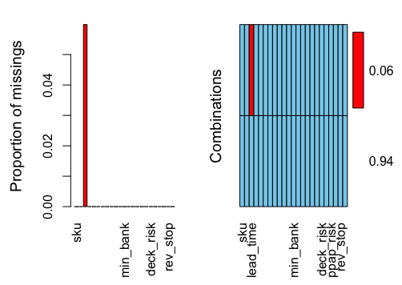
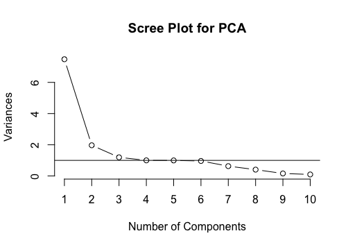

```{r setup, include=FALSE}
knitr::opts_chunk$set(echo = TRUE)
library(dplyr)
library(ggplot2)
library(plotly)
library(corrplot)
library(psych)        # For PCA analysis
library(VIM)          # For visualizing missingness
library(randomForest)


## data = read.csv("./Kaggle_Training_Dataset.csv")
## saveRDS(data, file = "train.RDS")
data = readRDS("./train.RDS")
```

## Data Summary

```{r}
## Get data summary
summary(data)

## Examine the first row of data
head(data,1)
```

---

## Exploratory Data Analysis

#### Correlation Plot


Let's examine the correlation of some of these variables. I suspect that there is high correlation between some variables
since they are measurements for different time periods.

```{r}
## We can only do correlation plots on numeric features so let's only select the numeric features.
M = data[sapply(data, is.numeric)]
## I decided to get rid of the third feature (lead time) since it was full of N/A's
M = M[,-3]

## Plot the correlation plot
```

<br/>
As expected, we can see the features which are metrics that are measured at different intervals are heavily correlated. This needs to be handled carefully when we build a model; we will probably need to do some feature selection. Interestingly enough, there are also two other features that have high correlations with other features: min_bank (minimum recommended amount to stock) and in_transit_qty (amount of product in transit from source). These two features are correlated with the forecast and sales metrics. It wouldn't be surprising if the forecast numbers are formulated with these features.
<br/>

<br/>
I also want to see how the missingness in the dataset looks like. Looking at the summary of the data, we note that the lead_time variable has NAs in it. Let's explore what sort of missingness is within the dataset.
<br/>

``` {r eval=FALSE}
## Missingness in Dataset
aggr(data, numbers=TRUE, only.miss=TRUE)
```
<center>  </center>

<br/>
As we suspected, only lead_time has missing values, with about 6% of the values being missing. Thinking about this variable, it may be possible that some new items that are new may have not historical data to calculate lead times. As a result, I would suspect that this data is missing not at random. I feel that this may induce some information leakage as newer items may be more prone to have backorders as there this not enough historical data.

To handle this missing data, I will be applying KNN imputation for this field.
<br/>

#### Visualizations

Cool, so we got to see the correlations of the numerical features. I want to visually inspect the forecast vs. actual sales now.

```{r}
## Create the density plot using ggplot
g = ggplot(data, aes(x=forecast_3_month, y=sales_3_month))
g = g + geom_bin2d() + geom_abline(intercept = 0, slope = 1) + ggtitle("Density bin plot for Sales vs. Forecast (3 Month)")

## Add plot_ly functionality to the graph
ggplotly(g)
```

<br/>
From this density chart, we can see that a majority of the short term (3 month) predictions are close to their forecast prediction values. This can be seen by the light blue bin in the bottom left hand corner. Since we are trying to limit backorders, the bins that we are interested in are the bins that have high sales but low forecast. To make this easier to visualize, I added a y = x line to the graph. Any bin that is above the line can have their forecast values improved to stop product backorder. Specifically, I am interested in the bins that have extremely high sales but low forecast values (the bins on the top left of the graph).
<br/>

``` {r}
## Feature engineering new metrics to combine sales and forecast
data = data %>% mutate(diff_3_month = sales_3_month - forecast_3_month)
data = data %>% mutate(diff_6_month = sales_6_month - forecast_6_month)
data = data %>% mutate(diff_9_month = sales_9_month - forecast_9_month)

## Summarize the new features
summary(data %>% select(diff_3_month, diff_6_month, diff_9_month))
```

<br/>
Looking at the summary stats for the differences in sales and forecasts, we can see that the average SKU has a higher forecast than sales value as seen by the negative mean value. The leads me to believe that the current forecasting model is more conservative for its 3 and 6 month forecasts.
<br/>

---

## Machine Learning

#### Unsupervised Learning - PCA
```{r, eval=FALSE}
## Perform principal component analysis on the data without the categorical features
M.pca <- prcomp(M,
                center = TRUE,
                scale. = TRUE)
pca = princomp(M, cor=T)

## Plot the scree plot to decide how many principal components to use
plot(M.pca, type = "l", main="")
abline(h = 1) #Adding a horizontal line at 1.
title(main="Scree Plot for PCA", xlab="Number of Components")

## Using 5 principal components, get summarized data
summary(M.pca)

## Look at the loadings of the principal components to see what features significantly contributed to each.
pca$loadings
```

<center>  </center>

#### Supervised Learning - Random Forest
<br/>
I'm going to start off our machine learning with a baseline random forest model. This is a classification problem: is the item going to go on backorder or not?
<br/>

```{r}
#Splitting the data into training and test sets by an 70% - 30% split.
summary(data)
set.seed(0)
train = sample(1:nrow(data), 7*nrow(data)/10) # Training indices.
val = data[-train, ]                          # Validation dataset.
response = val[23]                            # Validation responses (went_on_backorder)
val = val[-23]                                # Remove the went_on_backorder column from the response dataset

#Fitting an initial random forest to the training subset.
set.seed(0)
#rf.backorder = randomForest(went_on_backorder ~ ., data=data, subset = train, importance = TRUE)
#rf.boston = randomForest(went_on_backorder ~ ., data = data, subset = train, importance = TRUE)
#rf.boston
```


```{r include=FALSE}
## Cleanup temporary variable
rm(M)
```